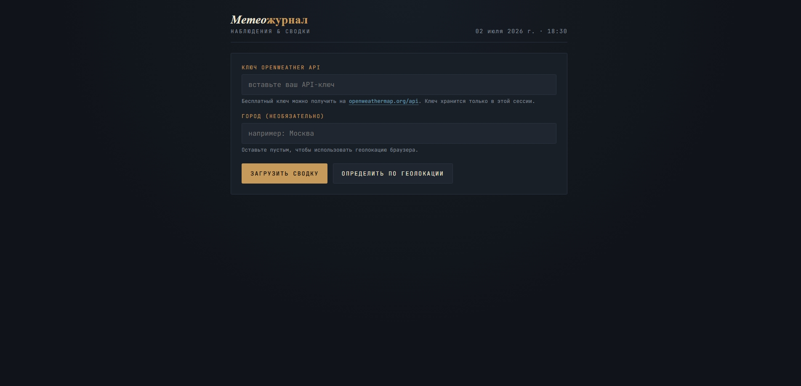

# 🌦 Weather Journal — Weather App

A modern weather web application built with vanilla HTML, CSS and JavaScript using the OpenWeather API.



## 🚀 Live Demo

**[➜ Open Weather Journal](https://rossiav802-code.github.io/Weather-app/)**

---

## ✨ Features

- 🌍 Search weather by city
- 📍 Current location support (Geolocation)
- 🌡 Current temperature and feels-like temperature
- 💧 Humidity, pressure, wind and visibility
- 🌅 Sunrise and sunset times
- 📈 24-hour temperature chart
- 📅 5-day weather forecast
- 🎨 Custom SVG weather icons
- 📱 Fully responsive design
- ⚡ Fast loading with Fetch API

---

## 🛠 Tech Stack


- Pure HTML, CSS, JavaScript — no frameworks
- OpenWeather API
- Fetch API
- Geolocation API
- SVG graphics
- Responsive design

---

## 📁 Project Structure

```text
weather-app/
├── index.html
├── styles.css
└── app.js
```

---

## 🚀 How to Run

1. Clone the repository:

```bash
git clone https://github.com/rossiav802-code/weather-app.git
```

2. Get a free API key from **OpenWeather**.

3. Open `index.html` in your browser.

Or just open the **[Live Demo](https://rossiav802-code.github.io/Weather-app)**

---

## 👤 Author

**Aslan Oymahmadov**

- GitHub: [@rossiav802-code](https://github.com/rossiav802-code)
- Email: rossiav802@gmail.com
